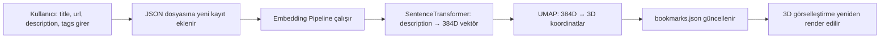

# Semantic Galaxy: 3D Bookmark Visualization System

Sosyal medyadan kaydettiğin içerikleri sematik ilişkilerine göre 3D uzayda görselleştiren ve akıllı arama özellikleri sunan sistem.

## Proje Hedefi

Kullanıcı manuel olarak eklediği linkleri/içerikleri:
- 3D uzayda sematik yakınlıklarına göre görselleştirmek
- Hem klasik tag filtreleme hem sematik arama ile erişilebilir kılmak
- Önce local geliştirme, sonra web/mobil erişim sağlamak

---

## Teknik Mimari

### Faz 1: Local Prototype (MVP)
**Teknoloji Stack:**
- **Backend**: Python 3.10+
- **ML/NLP**: sentence-transformers (all-MiniLM-L6-v2)
- **Dimensionality Reduction**: UMAP
- **Veri Saklama**: JSON/CSV
- **Arayüz**: Streamlit
- **3D Görselleştirme**: Plotly (3D Scatter)

### Faz 2: Web Deployment (Gelecek)
**Teknoloji Stack:**
- **Frontend**: Next.js + Three.js (Force-directed graph)
- **Backend**: Python FastAPI (microservice)
- **Deployment**: Vercel (frontend) + Railway/Render (backend)
- **Database**: PostgreSQL + pgvector (opsiyonel)

---

## Veri Modeli

### bookmarks.json Şeması
```json
[
  {
    "id": 1,
    "title": "AI Ses Değiştirici",
    "url": "https://example.com/ai-voice",
    "description": "Yapay zeka ile ses değiştirme, müzik prodüksiyonu, vokal",
    "tags": ["AI", "Ses", "Tool"],
    "date_added": "2025-12-04T02:16:54+03:00",
    "embedding": [0.123, -0.456, ...],  // 384 boyutlu vektör (sonradan eklenir)
    "umap_coords": [1.23, -0.45, 2.67]  // x, y, z koordinatları (sonradan eklenir)
  }
]
```

### Manuel Girdi (Kullanıcı sadece bunları girer)
- `title`: İçerik başlığı
- `url`: Link (opsiyonel, yoksa `null`)
- `description`: İçerik açıklaması (semantik arama için kritik)
- `tags`: Kategori etiketleri (liste)

### Otomatik Oluşturulan
- `id`: Auto-increment
- `date_added`: Timestamp
- `embedding`: ML model tarafından üretilir
- `umap_coords`: Görselleştirme için 3D koordinatlar

---

## Sistem İş Akışı

### 1. Veri Ekleme Akışı


### 2. Arama Akışı (Hybrid Search)

#### A) Tag Filtresi (Klasik)
```python
# Kullanıcı: ["AI", "Ses"] seçerse
filtered = [bookmark for bookmark in data 
            if any(tag in bookmark['tags'] for tag in selected_tags)]
```

#### B) Semantic Search (Vektör Benzerliği)
```python
# Kullanıcı: "müzik yapan robotlar" yazarsa
query_embedding = model.encode("müzik yapan robotlar")
similarities = cosine_similarity(query_embedding, all_embeddings)
results = sorted_by_similarity(similarities)[:10]  # Top 10
```

#### C) Hybrid (İkisinin Kombinasyonu)
```python
# Önce tag filtresi uygula, sonra semantik sıralama yap
tag_filtered = filter_by_tags(data, selected_tags)
semantic_ranked = rank_by_similarity(tag_filtered, query_text)
```

---

## Proje Dosya Yapısı

### Faz 1: Local (Streamlit)
```
c:/Users/Administrator/Desktop/SematicGalaxyContext/
│
├── data/
│   └── bookmarks.json              # Ana veri dosyası
│
├── src/
│   ├── embedding_engine.py         # SentenceTransformer + UMAP işlemleri
│   ├── data_manager.py             # JSON okuma/yazma, veri ekleme
│   └── search_engine.py            # Tag filtresi + semantic search
│
├── app.py                          # Streamlit ana uygulama
├── requirements.txt                # Python bağımlılıkları
└── README.md                       # Kurulum ve kullanım kılavuzu
```

### Faz 2: Web (Next.js + FastAPI)
```
├── frontend/                       # Next.js uygulaması
│   ├── components/
│   │   ├── GalaxyViewer.tsx       # Three.js 3D render
│   │   ├── SearchBar.tsx
│   │   └── BookmarkList.tsx
│   └── pages/
│       ├── index.tsx
│       └── api/search.ts           # Backend API çağrıları
│
└── backend/                        # FastAPI microservice
    ├── main.py                     # API endpoints
    ├── ml_service.py               # Embedding + UMAP
    └── database.py                 # PostgreSQL connection
```

---

## Komponent Detayları

### 1. `embedding_engine.py`
**Görev**: Metni 384 boyutlu vektöre çevir, 3D konumlara dönüştür

**Fonksiyonlar**:
- `generate_embeddings(descriptions: List[str]) -> np.ndarray`
  - SentenceTransformer ile tüm açıklamaları vektörleştir
  
- `reduce_dimensions(embeddings: np.ndarray) -> np.ndarray`
  - UMAP ile 384D → 3D dönüşümü
  - Parametreler: `n_neighbors=15, min_dist=0.1, metric='cosine'`
  
- `update_coordinates(bookmarks: List[dict]) -> List[dict]`
  - Tüm bookmarklar için embedding ve koordinat hesapla
  - Her yeni ekleme sonrası çalıştırılır

**UMAP Parametreleri**:
```python
umap_model = umap.UMAP(
    n_components=3,        # 3D output
    n_neighbors=15,        # Lokal komşuluk boyutu
    min_dist=0.1,          # Minimum nokta mesafesi
    metric='cosine',       # Vektör benzerliği için
    random_state=42        # Tekrarlanabilirlik (opsiyonel)
)
```

> [!NOTE]
> `random_state=42` kullanırsak aynı veri her zaman aynı haritayı üretir. Kullanmazsak her seferinde farklı layout oluşur. İlk aşamada kullan, sonra kaldırabiliriz.

---

### 2. `data_manager.py`
**Görev**: JSON okuma/yazma, yeni kayıt ekleme

**Fonksiyonlar**:
- `load_bookmarks() -> List[dict]`
- `save_bookmarks(data: List[dict])`
- `add_bookmark(title, url, description, tags) -> dict`
  - Yeni id oluştur
  - Timestamp ekle
  - JSON'a kaydet
  - Embedding pipeline trigger et

---

### 3. `search_engine.py`
**Görev**: Hybrid arama mantığı

**Fonksiyonlar**:
- `filter_by_tags(bookmarks, tags) -> List[dict]`
  - Klasik tag filtresi (AND veya OR mantığı)
  
- `semantic_search(query_text, bookmarks, top_k=10) -> List[dict]`
  - Query'yi embedding'e çevir
  - Cosine similarity hesapla
  - En yakın top_k sonucu döndür
  
- `hybrid_search(query_text, tags, bookmarks) -> List[dict]`
  - Önce tag filtresi
  - Sonra semantik sıralama

---

### 4. `app.py` (Streamlit Arayüz)
**Bileşenler**:

#### Sidebar (Sol Panel)
- **Yeni Kayıt Ekleme Formu**
  - Text input: Title
  - Text input: URL (opsiyonel)
  - Text area: Description
  - Multi-select: Tags
  - Submit button → `data_manager.add_bookmark()` çağrısı

#### Ana Ekran (Sekmeler)
1. **📊 Liste Görünümü**
   - Pandas DataFrame olarak tablo gösterimi
   - Filtreleme: Tag multi-select
   - Her satırda: title, url (link), tags, date
   
2. **🌌 3D Galaksi**
   - Plotly 3D Scatter plot
   - Noktalar: Her bookmark bir nokta
   - Renk: Tag'e göre renk kodlaması
   - Hover: Title + Description + Tags göster
   - İnteraktif: Zoom, rotate, pan
   
3. **🔍 Akıllı Arama**
   - Text input: Semantik sorgu ("müzik yapan AI araçları")
   - Multi-select: Tag filtresi
   - Search button → `hybrid_search()` çağrısı
   - Sonuçlar: Similarity score ile sıralı liste

---

## Görselleştirme Örneği

### Plotly 3D Scatter Konfigürasyonu
```python
fig = go.Figure(data=[go.Scatter3d(
    x=coords[:, 0],
    y=coords[:, 1],
    z=coords[:, 2],
    mode='markers+text',
    marker=dict(
        size=8,
        color=tag_colors,       # Tag'e göre renklendirme
        colorscale='Viridis',
        opacity=0.8,
        line=dict(width=1, color='white')
    ),
    text=[b['title'] for b in bookmarks],
    hovertext=[f"{b['title']}<br>{b['description']}" for b in bookmarks],
    hoverinfo='text'
)])

fig.update_layout(
    title="Semantic Galaxy - Bookmark Universe",
    scene=dict(
        xaxis=dict(showgrid=False, showticklabels=False),
        yaxis=dict(showgrid=False, showticklabels=False),
        zaxis=dict(showgrid=False, showticklabels=False),
        bgcolor='#0a0a0a'        # Siyah uzay arka planı
    ),
    height=700
)
```

**Renk Kodlaması Stratejisi**:
- Her unique tag için bir renk ata
- Birden fazla tag varsa dominant tag'in rengini kullan
- Alternatif: Tag sayısına göre gradient

---

## Implementasyon Aşamaları

### Faz 1.1: Temel Altyapı (Tahmini: 1-2 saat)
- [x] Proje klasör yapısını oluştur
- [x] `requirements.txt` hazırla
- [x] `data_manager.py` yaz (JSON okuma/yazma) → **Monolithic: app.py içinde**
- [x] Sample `bookmarks.json` oluştur (10 örnek veri) → **CSV olarak: data.csv**
- [x] Test: Veri ekleme/okuma çalışıyor mu? → **✅ Çalışıyor**

### Faz 1.2: ML Pipeline (Tahmini: 2-3 saat)
- [x] `embedding_engine.py` yaz → **Monolithic: app.py içinde**
- [x] SentenceTransformer entegrasyonu → **✅ Tamamlandı**
- [x] UMAP entegrasyonu → **✅ Tamamlandı**
- [x] Test: 10 veri için 3D koordinatlar üretiliyor mu? → **✅ Çalışıyor**

### Faz 1.3: Streamlit Arayüzü (Tahmini: 3-4 saat)
- [x] `app.py` temel yapısı → **✅ Tamamlandı**
- [x] Sidebar: Veri ekleme formu → **✅ Tamamlandı**
- [x] Sekme 1: DataFrame liste görünümü → **✅ Tamamlandı (Tab1'de)**
- [x] Sekme 2: Plotly 3D görselleştirme → **✅ Tamamlandı (Tab2'de)**
- [x] Test: Yeni veri ekle → 3D harita güncelleniyor mu? → **✅ Tamamlandı (st.rerun() ile otomatik)**

### Faz 1.4: Arama Özellikleri (Tahmini: 2-3 saat) ✅ %100
- [x] `search_engine.py` yaz → **Monolithic: app.py içinde**
- [x] Tag filtresi → **✅ Tamamlandı (sidebar multi-select)**
- [x] Semantic search (cosine similarity) → **✅ Tamamlandı**
- [x] Hybrid search kombinasyonu → **✅ Tamamlandı (tag + semantic)**
- [x] AND/OR toggle → **✅ Tamamlandı (checkbox)**
- [x] Filtered 3D visualization → **✅ Tamamlandı**

### Faz 1.5: İyileştirmeler (Tahmini: 2-3 saat)
- [x] Performans optimizasyonu (caching) → **✅ Progress bar normalization**
- [x] UI/UX iyileştirmeleri → **✅ Dark mode, auto-refresh, progress bars**
- [x] Hata yönetimi → **✅ NaN handling, validation, error messages**
- [x] **CRUD Operations** → **✅ Tab 3: Veri Yönetimi (Edit/Delete)**
- [x] **Tag auto-normalization** → **✅ clean_tags() improvements**
- [ ] İlk 100 verini ekle ve test et → **🔄 User tarafından yapılacak**

**Toplam Tahmini Süre**: 10-15 saat (tek kişi, yan proje hızında)

---

### Faz 2: Web Deployment (Gelecek - Opsiyonel)

> [!IMPORTANT]
> Bu faz Streamlit prototype tamamlandıktan sonra değerlendirilecek. Mobil kullanım kritik hale gelirse:

#### 2.1: Backend API (FastAPI)
- [ ] Streamlit kodunu FastAPI endpoint'lerine dönüştür
- [ ] `/api/bookmarks` GET/POST
- [ ] `/api/search` POST (hybrid search)
- [ ] `/api/coordinates` GET (3D koordinatlar)

#### 2.2: Frontend (Next.js)
- [ ] Three.js ile 3D force-directed graph
- [ ] Force simulation: `d3-force-3d`
- [ ] Mobil responsive tasarım
- [ ] PWA (Progressive Web App) yapılandırması

#### 2.3: Database Migration
- [ ] JSON → PostgreSQL geçişi
- [ ] pgvector extension (vektör aramaları için)
- [ ] Indexing stratejisi

---

## Performans Değerlendirmesi

### Hesaplama Maliyetleri (1000 veri için)

| İşlem | Süre | Sıklık |
|-------|------|--------|
| Embedding oluşturma (384D) | ~2-3 saniye | Her veri eklemede |
| UMAP (384D → 3D) | ~1-2 saniye | Her veri eklemede |
| Plotly render | ~0.5 saniye | Her sayfa yenilemede |
| Semantic search query | ~0.1 saniye | Her arama |
| **TOPLAM (yeni veri ekleme)** | **~4-6 saniye** | - |

> [!TIP]
> İyileştirmeler:
> - **Batch processing**: 5-10 veri eklenene kadar bekle, sonra tek seferde hesapla
> - **Caching**: Streamlit `@st.cache_data` kullan
> - **Incremental UMAP**: Gelişmiş özellik (Faz 2)

---

## Örnekler ve Kullanım Senaryoları

### Senaryo 1: İçerik Keşfi
**Durum**: "AI ses araçlarını eklemiştim, buna benzer başka toollar var mı?"

**Çözüm**:
1. 3D haritada "AI Ses Değiştirici" noktasına tıkla
2. Sistem otomatik olarak yakındaki noktaları highlight eder
3. Alternatif: Semantic search → "AI ses araçları benzer"

### Senaryo 2: Tag Kombinasyonları
**Durum**: "Hem AI hem Tasarım ile ilgili toolları görmek istiyorum"

**Çözüm**:
1. Liste görünümünde tag filtresi: ["AI", "Tasarım"]
2. Intersection (AND) veya Union (OR) seçeneği
3. Sonuçlar tablo ve 3D haritada filtrelenir

### Senaryo 3: Bulanık Arama
**Durum**: "Video düzenlemeyle alakalı bir şey vardı ama ne olduğunu tam hatırlamıyorum"

**Çözüm**:
1. Semantic search: "video editing"
2. Sistem "video", "montaj", "edit" gibi semantically related içerikleri getirir
3. Similarity score'a göre sıralı liste

---

## Bağımlılıklar ve Kurulum

### requirements.txt
```txt
# Core
streamlit==1.30.0
pandas==2.1.4

# ML/NLP
sentence-transformers==2.2.2
umap-learn==0.5.5
scikit-learn==1.3.2

# Visualization
plotly==5.18.0

# Utilities
numpy==1.26.2
```

### Kurulum Komutları
```bash
# Virtual environment oluştur
python -m venv venv
venv\Scripts\activate  # Windows

# Bağımlılıkları yükle
pip install -r requirements.txt

# Uygulamayı çalıştır
streamlit run app.py
```

> [!WARNING]
> **Model İndirme**: İlk çalıştırmada `sentence-transformers` modeli (~80MB) indirilecek. İnternet bağlantısı gerekir.

---

## Gelecek İyileştirmeler (Backlog)

### Özelliklere Eklenebilecekler

#### 🔴 Kritik Öncelik
- [x] **Bookmark düzenleme/silme**: Update ve delete işlemleri (CRUD completion) → **✅ v0.3 Tamamlandı**
  - Tab 3: Veri Yönetimi sekmesi
  - Excel-like editing (st.data_editor)
  - Satır ekleme/silme (num_rows='dynamic')
  - Otomatik tag normalizasyonu
  - Boş değer validasyonu
- [ ] **Tag filtresi (Sidebar)**: Multi-select ile içerik filtreleme
  - Tüm unique tag'leri listele
  - AND/OR mantığı seçimi
  - Hem liste hem 3D haritayı filtrele

#### 🟡 Orta Öncelik  
- [x] **Kelime Bulutu (Word Cloud)**: En çok kullanılan tag görselleştirmesi → **✅ v0.5 Tamamlandı**
  - Tab 4: "☁️ Analiz" sekmesi
  - WordCloud: Dark mode, viridis palette
  - Top 10 bar chart (Plotly)
  - 2 kolonlu layout
  - Memory leak fix (plt.close)
- [ ] **LLM Sohbet Asistanı**: Bookmark'larla konuşma
  - Gemini/GPT API entegrasyonu
  - Context: Tüm bookmark description'ları
  - Örnek sorgu: "AI ses toollarıyla Notion AI arasındaki fark nedir?"
  - Cevap: LLM bookmark'larını analiz edip özet çıkarır
  - RAG (Retrieval-Augmented Generation) yaklaşımı
- [ ] **Kategoriler**: Tag'ler dışında üst seviye kategoriler
- [ ] **Notlar**: Her bookmark'a kişisel notlar
- [ ] **Favoriler**: Favori işaretleme sistemi
- [ ] **Export/Import**: CSV, Markdown, JSON formatlarında dışa aktarma
- [ ] **Dark mode**: Kullanıcı tercihi (UI toggle)
- [ ] **Multi-language**: Türkçe/İngilizce içerik desteği

### Teknik İyileştirmeler
- [ ] **Incremental learning**: Eski embeddingler değişmesin
- [ ] **Clustering gösterimi**: K-means ile otomatik kümeler
- [ ] **Benzerlik ağı**: Belirli threshold üstü benzer içerikler arasında çizgiler
- [ ] **Timeline view**: Zaman bazlı görselleştirme
- [ ] **Mobile app**: React Native wrapper

---

## Sonraki Adım

Bu plan sana uygun görünüyorsa:
1. **Onay** ver, direkt koda geçelim
2. **Sorular** varsa, şimdi soralım
3. **Değişiklik** istiyorsan, planı güncelleyelim

**Önerim**: Faz 1.1'den başlayıp sırayla ilerleyelim. Her faz sonunda test edip garantiye alalım.

Hazır mısın?
