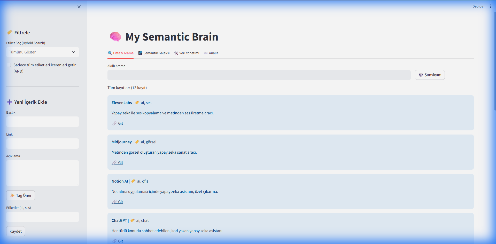
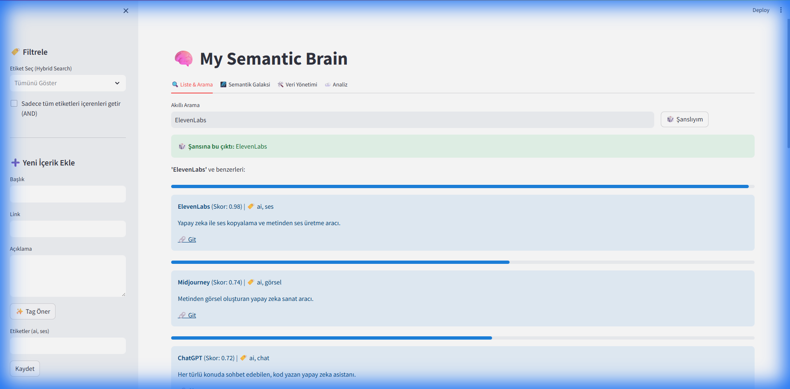
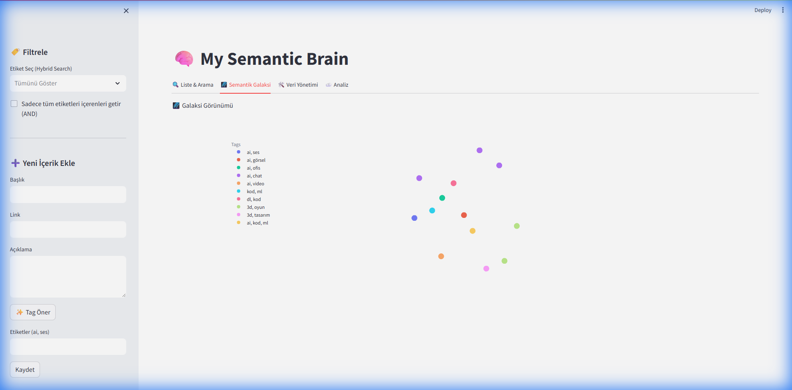
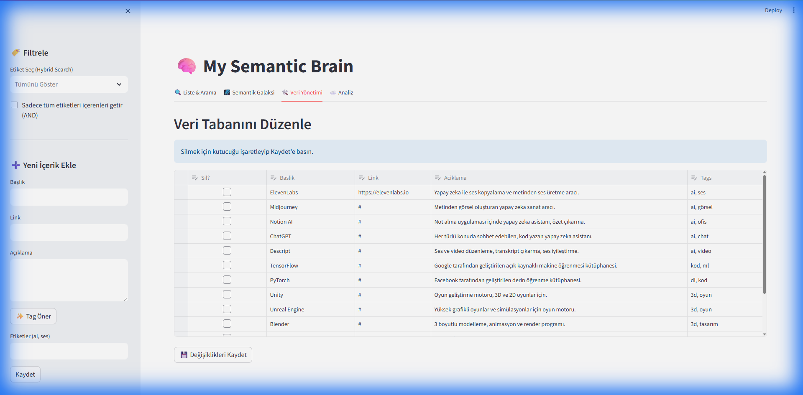
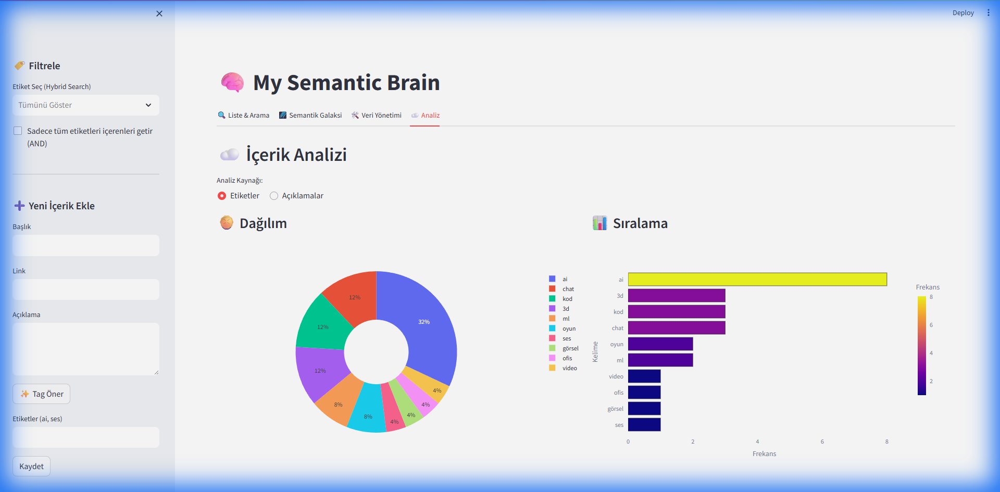

# 🌌 Semantic Galaxy

[](https://sematicgalaxycontext-ysbtyhl4rqg7ijsja43fs4.streamlit.app/)


> 3D semantik bookmark görselleştirme ve akıllı arama sistemi.

**Semantic Galaxy**, kaydettiğin içerikleri makine öğrenmesi ile analiz edip 3D uzayda görselleştiren, tag'ler ve semantik arama ile erişim sağlayan yeni nesil kişisel bilgi yönetim sistemidir.



### 📸 Özellik Galerisi

<details>
<summary>🔍 Akıllı Arama & Şanslıyım Butonu</summary>


*Rastgele bookmark keşfi ve semantik benzer sonuçlar*
</details>

<details>
<summary>🌌 3D Semantik Galaksi</summary>


*UMAP ile 3D uzayda interaktif görselleştirme*
</details>

<details>
<summary>🛠️ Veri Yönetimi (CRUD)</summary>


*Excel-like editing, checkbox ile toplu silme*
</details>

<details>
<summary>☁️ Analytics & Word Cloud</summary>


*Word Cloud, Pie Chart, Bar Chart - Türkçe stopwords ile*
</details>

---

## 🎯 Problem & Çözüm

**Sorun**: Sosyal medyada ilginç içerikler buluyorsun, kaydediyorsun, zamanla yüzlerce kayıt birikiyor ama bulamıyorsun.

**Çözüm**: Semantic Galaxy içeriklerini **anlar**, **ilişkilenir** ve **görselleştirir**.

---

## ✨ Özellikler (v0.6)

### 🔍 Akıllı Arama
- ✅ **Semantik arama**: Natural language query ("müzik yapan robotlar")
- ✅ **Tag filtresi**: Multi-select, AND/OR logic toggle
- ✅ **Hybrid search**: Tag + semantik kombinasyonu
- ✅ **Progress bars**: Benzerlik skorları ile görsel feedback

###🌌 Görselleştirme
- ✅ **3D galaksi**: Plotly interactive, dark mode
- ✅ **Dinamik filtreleme**: Seçili tag'lere göre 3D harita güncellenir
- ✅ **Hover detaylar**: Başlık, açıklama, tag bilgileri

### ☁️ İleri Seviye Analitik (YENİ - v0.6)
- ✅ **Word Cloud**: Tag ve açıklama analizi
- ✅ **Pie Chart**: Top 10 dağılımı (donut style)
- ✅ **Bar Chart**: Frekans sıralaması
- ✅ **Stop Words**: Türkçe etkisiz kelime filtresi
- ✅ **Kaynak seçimi**: "Etiketler" veya "Açıklamalar" analizi

### 🛠️ Veri Yönetimi
- ✅ **Excel-like editing**: Inline düzenleme (st.data_editor)
- ✅ **Checkbox silme**: Toplu satır silme + toast notifications
- ✅ **Auto-refresh**: st.rerun() ile otomatik güncelleme
- ✅ **Tag normalizasyonu**: Otomatik clean, sort, deduplicate
- ✅ **Validasyon**: NaN handling, boş değer kontrolü

### 🧠 ML Pipeline
- ✅ **sentence-transformers**: all-MiniLM-L6-v2 model (384D)
- ✅ **Tag-aware embeddings**: Description + tags birlikte
- ✅ **UMAP**: 384D → 3D konumlama
- ✅ **Cosine similarity**: Semantik benzerlik

---

## 🛠️ Teknoloji

```
Backend: Python 3.10+, pandas, scikit-learn
ML/NLP: sentence-transformers, UMAP
Frontend: Streamlit, Plotly
Analytics: WordCloud, matplotlib
Storage: CSV (lightweight, portable)
```

---

## 🚀 Kurulum

### Hızlı Başlangıç

```bash
# 1. Clone
git clone <repo-url>
cd SematicGalaxyContext

# 2. Virtual environment
python -m venv venv
venv\Scripts\activate  # Windows
# source venv/bin/activate  # macOS/Linux

# 3. Dependencies
pip install -r requirements.txt

# 4. Run
streamlit run app.py

# 5. Open browser
http://localhost:8501
```

### Gereksinimler
- Python 3.10+
- 4GB RAM
- İnternet (ilk çalıştırmada model indirimi, ~80MB)

---

## 📖 Kullanım

### 1. İçerik Ekleme (Sidebar)
```
Başlık: AI Ses Değiştirici
Link: https://elevenlabs.io
Açıklama: Yapay zeka ile ses kopyalama ve text-to-speech
Etiketler: ai, ses, tool
```

### 2. Arama & Filtreleme (Tab 1)
**Tag Filtresi:**
- Etiket seç: ["ai", "ses"]
- AND/OR toggle: ☐ "Tüm etiketleri içerenleri getir"

**Semantik Arama:**
- Sorgu: "müzik yapan programlar"
- Sistem: "music", "audio", "production" içeren tüm benzer içerikler

### 3. 3D Galaksi (Tab 2)
- Fare ile döndür/zoom
- Benzer içerikler yakında
- Renk = Tag kategorisi

### 4. Analitik (Tab 4) ✨ YENİ
**Kaynak Seçimi:**
- 🔘 Etiketler: Genel kategorilere bak
- 🔘 Açıklamalar: İçerik detaylarına in

**Görselleştirmeler:**
- 🥧 Pie Chart: Dağılım yüzde
- 📊 Bar Chart: Frekans sıralaması
- ☁️ Word Cloud: Kelime bulutu (stop words temiz)

### 5. Veri Yönetimi (Tab 3)
- Tabloda direkt düzenle
- "Sil" checkbox'ı işaretle
- "Kaydet" → otomatik refresh

---

## 📊 Veri Modeli

### CSV Format
```csv
Baslik,Link,Aciklama,Tags
"ElevenLabs","https://elevenlabs.io","AI sesklonlama","ai, ses, tool"
"Midjourney","#","Metinden görsel AI","ai, görsel, sanat"
```

> **Not**: `x, y, z` koordinatları runtime'da hesaplanır, CSV'ye kaydedilmez.

---

## 🎨 Kullanım Senaryoları

### Senaryo 1: "Buna benzer ne var?"
**Durum**: "AI ses aracı" eklemişsin, benzerlerini istiyorsun.

**Çözüm**:
1. **Tab 2** (3D Galaksi) → "AI Ses" noktasının yakınındaki noktalar
2. veya **Tab 1** (Arama) → "ses değiştirme ai"

### Senaryo 2: "AI + Video kombinasyonu"
**Durum**: Hem AI hem video tag'li araçları görmek istiyorsun.

**Çözüm**:
1. Sidebar → Tag filtresi: ["ai", "video"]
2. AND toggle → ☑ (her ikisi de olsun)
3. **Tab 2** → Sadece ikisini de içeren noktalar

### Senaryo 3: "Beynim ne hakkında dolu?"
**Durum**: Genel dağılımı görmek istiyorsun.

**Çözüm**:
1. **Tab 4** (Analitik)
2. Kaynak: 🔘 Etiketler
3. Pie Chart: "%40 AI, %25 Tasarımım, %15 Video" gibi

---

## 🔧 Özelleştirme

### Stop Words Listesi
`stopwords.txt` dosyasına ekle/çıkar:
```
ve
ile
bir
bu
...
```

### Embedding Modeli Değiştir
```python
# app.py satır 13
model = SentenceTransformer('all-MiniLM-L6-v2')  # İngilizce

# Türkçe için:
model = SentenceTransformer('paraphrase-multilingual-MiniLM-L12-v2')
```

### UMAP Parametreleri
```python
# app.py satır 82-85
n_neighbors = min(15, len(dataframe) - 1)  # Komşuluk boyutu
min_dist = 0.1  # Nokta mesafesi (kodu içinde hardcoded)
```

---

## 📈 Performans

| İşlem | Süre (100 veri) | Notlar |
|-------|-----------------|--------|
| Embedding | ~1 saniye | İlk çalıştırmada model indirimi |
| UMAP | ~0.5 saniye | Veri artınca artar |
| Render | ~0.2 saniye | Browser tarafında |
|**Toplam** | **~2 saniye** | Yeni veri ekleme |

**Caching**: Streamlit `@st.cache_resource` otomatik

---

## 🗺️ Roadmap

### ✅ Tamamlanan (v0.6)
- [x] Semantik arama & tag filtresi
- [x] AND/OR logic
- [x] Word cloud & analytics
- [x] Stop words sistemi
- [x] Checkbox delete
- [x] Auto-refresh
- [x] Tag normalizasyonu

### 🔜 Sırada (v0.7)
- [ ] N-Grams analizi (bigrams, trigrams)
- [ ] Export/Import (CSV, JSON)
- [ ] Description word cloud
- [ ] Tag consistency checker

### 🔮 Gelecek (v1.0)
- [ ] LLM chat integration (RAG)
- [ ] Verb extraction (eylem analizi)
- [ ] Co-occurrence network
- [ ] Sentiment analysis

---

## 🤝 Katkıda Bulunma

Öneri/hata için GitHub Issues kullan.

---

## 📝 Lisans

Kişisel kullanım. Ticari için iletişim.

---

## 🙏 Teşekkür

- [sentence-transformers](https://www.sbert.net/)
- [UMAP](https://umap-learn.readthedocs.io/)
- [Streamlit](https://streamlit.io/)
- [Plotly](https://plotly.com/)
- [WordCloud](https://github.com/amueller/word_cloud)

---

<div align="center">

**v0.6 - Production Ready** 🚀

[Demo](#) | [Dokümantasyon](FUTURE_VISION.md) | [İssues](#)

</div>
